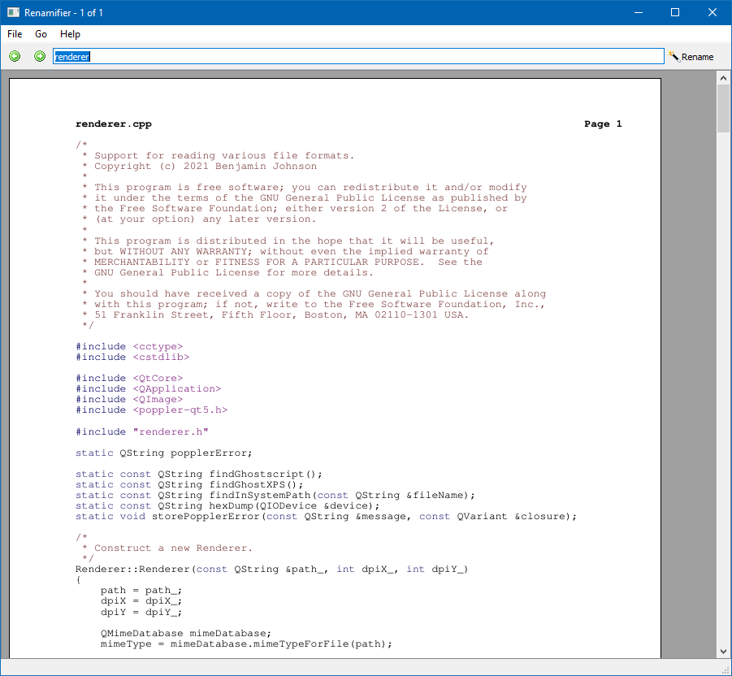

**Renamifier** is a tool to preview and rename digital files.



Renamifier lets you rename files while you're viewing them, making it easier to give them meaningful names. It's great for organizing files with automatically-generated names, like scanned documents or digital camera photos.


## Downloads

File | Size | Description
---- | ---- | -----------
[renamifier-0.1.2-win32-setup.exe](https://github.com/bmjcode/renamifier/releases/download/v0.1.2/renamifier-0.1.2-win32-setup.exe) | 39.6 MB | Windows (32-bit installer)
[renamifier-0.1.2-win64-setup.exe](https://github.com/bmjcode/renamifier/releases/download/v0.1.2/renamifier-0.1.2-win64-setup.exe) | 39.3 MB | Windows (64-bit installer)
[renamifier-0.1.2.zip](https://github.com/bmjcode/renamifier/archive/refs/tags/v0.1.2.zip) | | source code (zip)
[renamifier-0.1.2.tar.gz](https://github.com/bmjcode/renamifier/archive/refs/tags/v0.1.2.tar.gz) | | source code (tar.gz)


## How to Use Renamifier

Using Renamifier is pretty straightforward:

1. Select the files you want to rename. The first file will be displayed.
2. Enter a new name for the file. You don't have to include the extension; Renamifier will automatically keep its current extension.
3. Press Enter (or click the "Rename" button) to rename this file. The next file will be displayed.
4. Repeats steps 2 and 3 for each remaining file.


## Supported File Formats

Renamifier has built-in support for the following formats:

Format | Extensions | Notes
------ | ---------- | -----
Plain text | Various | Includes files with an explicit `.txt` extension, as well as other plain-text formats like source code.
Bitmap image | `.bmp` |
GIF | `.gif` | Animations are not currently supported.
JPEG | `.jpe`, `.jpg`, `.jpeg` |
PNG | `.png` |
Netpbm | `.pbm`, `.pgm`, `.pnm`, `.ppm` |
X11 bitmap | `.xbm` |
X11 pixmap | `.xpm` |

Renamifier can also display these formats if additional software is installed:

Format | Extensions | Requirements | Notes
------ | ---------- | ------------ | -----
Postscript | `.ps` | [Ghostscript](https://ghostscript.com/) |
XPS | `.xps` | [GhostXPS](https://www.ghostscript.com/download/gxpsdnld.html) (included on Windows) | OpenXPS has not been tested.


## Building from Source

To build Renamifier from source, you will need:

* [Qt 5](https://www.qt.io/)
* [Poppler](https://poppler.freedesktop.org/)
* [CMake](https://cmake.org/)

Basic build instructions:

```
mkdir /tmp/renamifier-build
cd /tmp/renamifier-build
cmake /path/to/renamifier/sources
make && make test
```

On Windows, you can use [MSYS2](https://www.msys2.org/). Replace the third line above with:

```
cmake -G 'MSYS Makefiles' /path/to/renamifier/sources
```

The Windows installers are built with [NSIS](https://nsis.sourceforge.io/). See the comments at the start of [winsetup.nsi](winsetup.nsi) for details.
