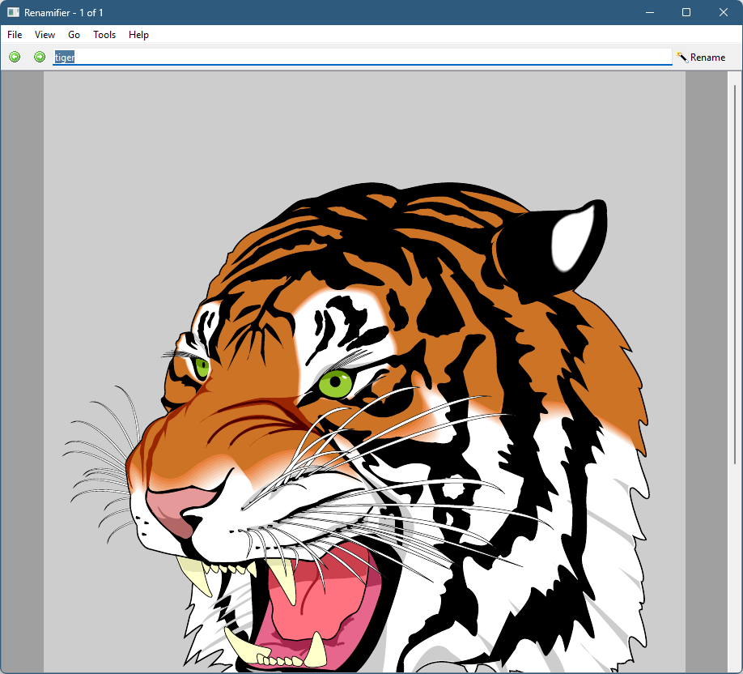

**Renamifier** is a tool to preview and rename digital files.



I created Renamifier to more easily organize files with automatically-generated names like scanned documents and digital photos. It is intended to "[do one thing and do it well](https://en.wikipedia.org/wiki/Unix_philosophy)" rather than to replace full-featured dedicated viewers like Acrobat Reader.

Downloads are available on the project's [GitHub releases page](https://github.com/bmjcode/renamifier/releases).

Please be aware that Renamifier is a low-priority personal project; development does not follow a set plan or schedule, and is largely driven by my own needs. Issues and pull requests are therefore closed since I can't promise they'll be responded to in any reasonable amount of time.


## Supported File Formats

Renamifier has built-in support for the following formats:

Format | Extensions | Notes
------ | ---------- | -----
Plain text | Various | Includes files with an explicit `.txt` extension, as well as other plain-text formats like source code.
PDF | `.pdf` |
Bitmap image | `.bmp` |
GIF | `.gif` | Animations are not currently supported.
JPEG | `.jpe`, `.jpg`, `.jpeg` |
PNG | `.png` |
Netpbm | `.pbm`, `.pgm`, `.pnm`, `.ppm` |
X11 bitmap | `.xbm` |
X11 pixmap | `.xpm` |

Renamifier can also display these formats if additional software is installed:

Format | Extensions | Requirements | Notes
------ | ---------- | ------------ | -----
Postscript | `.ps` | [Ghostscript](https://ghostscript.com/) |
XPS | `.xps` | [GhostXPS](https://www.ghostscript.com/download/gxpsdnld.html) | OpenXPS has not been tested.

All other file types are displayed as a [hex dump](https://en.wikipedia.org/wiki/Hex_dump), which may or may not contain anything meaningful, but at least it looks cool.


## Building from Source

To build Renamifier from source, you will need:

* [Qt 6](https://www.qt.io/)
* [Poppler](https://poppler.freedesktop.org/)
* [CMake](https://cmake.org/)

Basic build instructions:

```
mkdir /tmp/renamifier-build
cd /tmp/renamifier-build
cmake /path/to/renamifier/sources
make && make test
```

On Windows, you can use [MSYS2](https://www.msys2.org/). Replace the third line above with:

```
cmake -G 'MSYS Makefiles' /path/to/renamifier/sources
```

The Windows installers are built with [NSIS](https://nsis.sourceforge.io/). See the comments at the start of [winsetup.nsi](winsetup.nsi) for details.
